# **Soldier Management System WITH Community**
___
## **주제**
___
#### '병력 관리 & 지원 어플리케이션'

## **개요**
___
> - 군 장병들을 대상으로 서비스를 제공한다. 

> - 주요 서비스는 다음과 같다.
>> 1. 병력 관리
>> 2. 커뮤니티
>> 3. 기타 복무 정보 관리
> - 병력 관리 기능은 보고 간편화로 현재의 불필요한 행정 소요와 인력 낭비를 줄인다.
> - 커뮤니티 기능은 장병간의 소통, 정보 공유 목적으로 활용된다.
> - 기타 정보 기능은 휴가 사용 내역, 상벌점, 전역일 계산등의 정보를 제공한다.
 
> - 군 장병들이 사용하는 어플리케이션인 만큼 `보안성` 을 가장 중요한 요소로 설계하였으며, 이를 위한 인증절차를 도입하였다.

## **개발 배경**
___
> - **출타 장병 관리의 비효율성**
>#### 일부 출타 복귀 병사들은 담당 간부에게 보고할 필요가 있는 경우가 있다. 담당 간부에 따라 보고 방법, 횟수, 시간등이 모두 달라 이를 통합적으로 관리할 수 있는 시스템의 필요성을 느끼기 되었다. 병사들은 계속해서 연락을 기다리며 긴장하고 있을 필요가 없고 담당 관리자는 출타 병사들의 상황을 확인하기 위해 수차례 연락을 취할 필요도 없다. 그냥 앱을 켜기만 하면 된다.
> - **병사 소통의 공간 부재**
>#### 현재까지 군인만 참여 가능한, 군인들이 함께 모여 소통할수 있는 커뮤니티는 없었다. 군 장병 대상 데이터는 수집, 활용되기 힘들었고 같은 고민거리가 있는 사람들 끼리 만나서 함께 고민을 나눌 수 있는 방법 또한 부족했다. 데이터 수집을 통해 군 장병을 대상으로한 각종 맞춤형 편의 서비스를 제공할 수 있으며 서로 정보 공유 및 소통의 장으로 활용할 수도 있다.
## **활용성**
___
> - 출타 장병들은 손쉽게 복귀 보고륵, 관리자는 장병들의 보고 리스트를 종합적으로 관리 가능하다. 여기에 보고 및 종합 관리 기능을 활용하여 추후에 `메모 보고`, `긴급 보고`, `고속상황전파체계`, `실시간 상황 보고 및 계획하달`  등의 기능을 추가로 구현 가능하다. 
> - 커뮤니티의 경우 각 기지 단위 부대 게시판으로 분리하여 기지내에서는 부대내 행사, 동아리 활동, 스포츠 활동에서 외부에서는 관광, 식사, 터미널(또는 역) 동행등 맞춤형 정보 제공으로 더 편리하게 이용할 수 있을 것이다.

## **개발효과**
___
> - **보안성을 중점으로 한 인터넷, 인트라넷 사용자 연동**
>####  현재 국방부는 국방망과 인터넷망이 철저하게 분리되어 있다. 최고의 보안이 필요한 군대이기 때문에 현재 두 망 사이에서는 데이터를 교환기 위해서는 대부분 수작업을 통한 자료교환이 이루어졌다. 위 어플리케이션에서 사용하는 인증 방법은 기존의 문제점을 해결하고 보안성을 높이는 방법으로, 다른 인증 절차에 활용 가능할 것으로 기대된다.
> - **출타 관리의 간편화**
>####  간단한 조작을 통해 출타 장병들의 복귀 보고가 가능하다. 관리자(간부)는 복귀일을 기준으로 병사들의 보고를 종합하여 받을 수 있고 최소한의 연락만으로 효율적으로 출타 장병들을 관리할 수 있다. 기존에는 병사 개개인당 수차례씩 전화를 하는 불편함이 있었지만, 해당 어플을 활용하면 불필요한 노력을 최소한으로 줄일 수 있고 관리자(간부)의 생산성과 업무 집중도를 높일 수 있다.
>  - **군 전용 커뮤니티 활성화**
> #### 해당 어플리케이션은 군인만 이용가능한 군 전용 커뮤니티를 제공한다. 군인만 사용하기 때문에 군인에게 도움이 되고 정말 필요한 정보들이 공유되고 수집될 것으로 기대된다.
>> -  자기 개발
>> #### 커뮤니티 기능을 활용하여 자기 개발에 필요한 여러 정보들을 공유할 수 있고, 목표가 유사한 사람들끼리 함께 모이는 기회를 제공할 수 있다.
>> -  동아리, 종교 모임
>> #### 지역 단위 부대의 게시판을 관리하여 동아리, 종교 활동 같은 모집, 홍보를 할 수 있다.
>> -  복지, 생활환경 개선
>> #### 출타했을 때 군인을 위한 커뮤니티가 없어 교통, 식사, 숙박, 편의 시설, 기타 출타 시 꿀팁 등 군인에게 꼭 필요한 정보들을 서로 공유 가능하다. 

## **결론**
___
> - 해당 어플리케이션은 불필요한 행정 소요와 인력낭비는 줄이고, 병사들 상호간 소통과 자기개발의 기회를 넓혀줄 것으로 기대된다. 

## **어플리케이션 화면 소개**
___
> - 메인 화면
> 
>  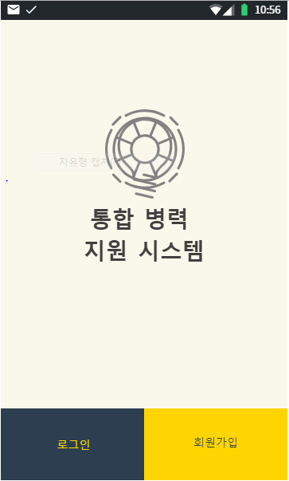

> - 로그인 / 회원가입
>>   - 회원 가입을 하기 위해서는 인증용으로 사전에 부여받은 keycode 값이 필요하다. keycode 값을 이용하여 사용자 가입 가능 여부를 확인한다. 
> 
>  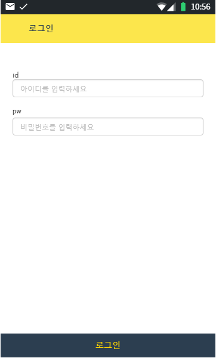
>  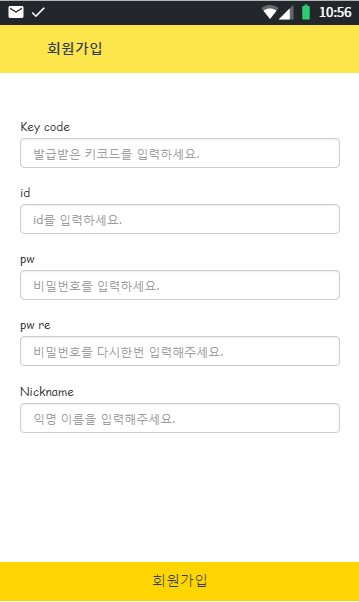

> - 출타 보고 / 관리
>>   - 사용자 계정 유형에 따라 출타 탭을 눌렀을때 보이는 화면이 달라진다. 일반 사용자(병사)가 사용했을 때 좌측 화면이, 관리자(간부)가 사용할 때는 우측 화면이 나타난다. 
>>   - **병사용**(좌측) 출타 기간과 복귀 예정시간을 설정할 수 있다. 설정한 날짜와 시간은 서버로 전송된다. 현재까지 나간 출타 일수와 출타 정보, 병기본 등급, 상.벌점 등 개인의 행정적 정보도 함께 관리할 수 있다. 이후에 SNS에 공유할 수 있는 기능을 추가하여 모범적인 군생활을 SNS에 공유할 수 있도록 만들고, 군생활에 뿌듯함을 느끼며 군장병 서로에게 동기부여가 될 수 있도록 한다.
>>   - **관리자용**(우측) 종합된 병사들의 출타 정보를 보여준다. 복귀 예정시간별로 병사들의 정보를 확인 할 수 있어서 각 시간대별 몇명이 복귀할지 미리 확인할 수 있다. 병사들의 출타 예정사항을 주별, 월별로 미리 확인할수 있다. 
>
>  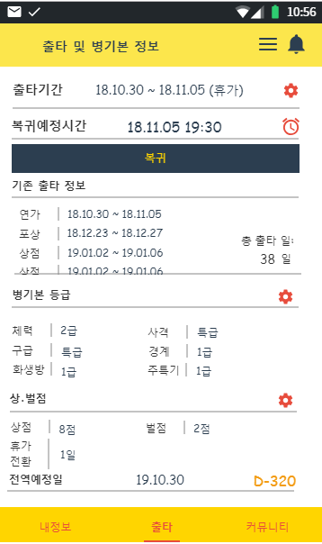
>  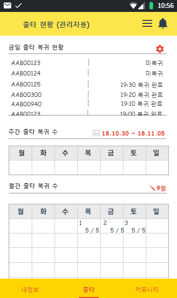
>

> - 커뮤니티 게시판
>>   - 원하는 분야를 선택해서 해당 영역의 게시물 확인 및 작성을 할 수 있고, 관심있는 게시물에는 댓글을 달 수 있다. 서로 고민을 나눌 수도 있고 취미, 동아리 활동/모집등에 활용할 수 있다.
> 
>  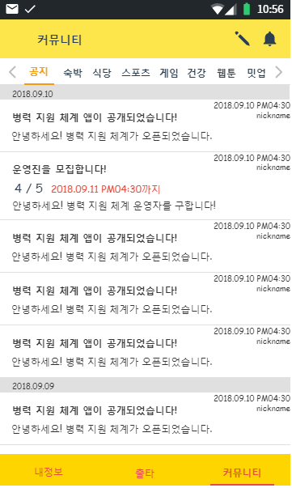
>  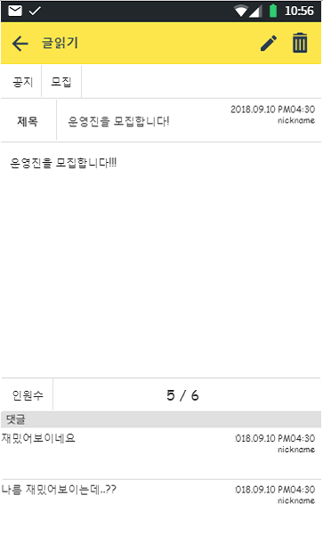
>  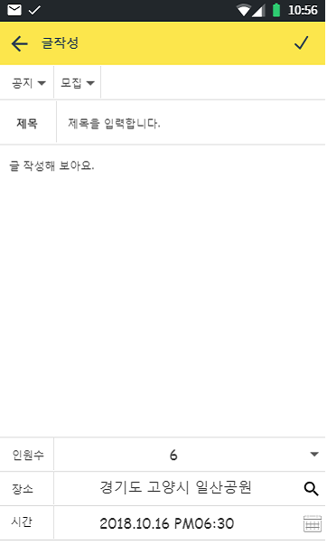
>

> - 사용자 정보 확인 / 변경
>>   - 사용자 계정 정보와 어플리케이션 정보를 확인할 수 있으며 사용자 정보 수정이 필요한 경우 수정할 수 있다.
>
>  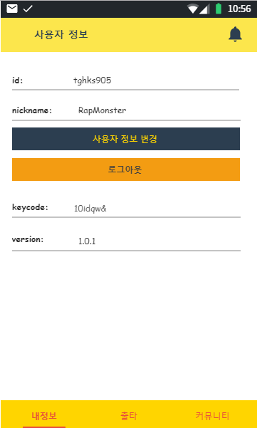
>  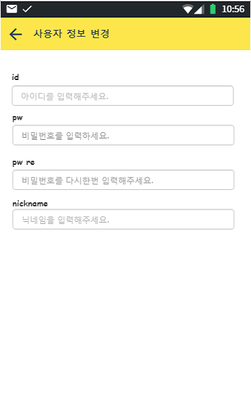

## **인트라넷 화면 소개**
___
> - 인트라넷에서 외부망(인터넷) 사용자의 가입을 허가하기 위한 연동 페이지
> - 관리자는 이 페이지에서 키코드값 추가/제거가 가능하며 일반 사용자는 키코드 값 접근이 불가능하다.
>  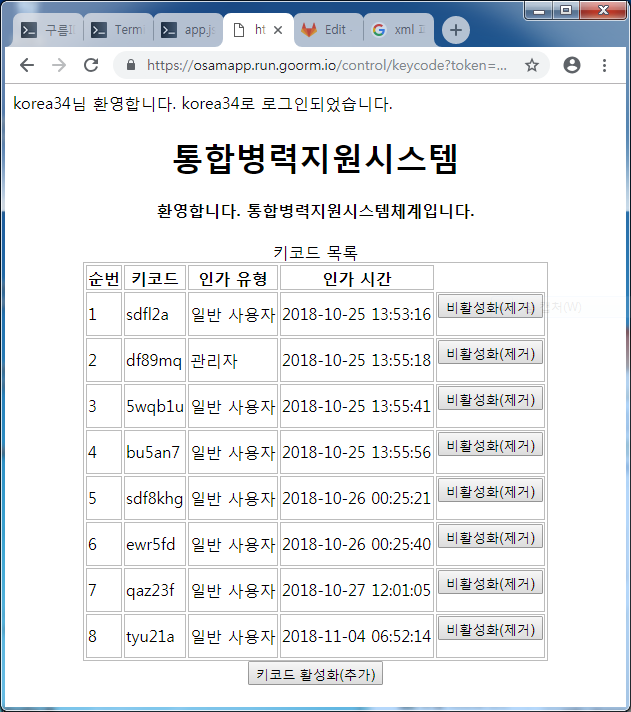
>  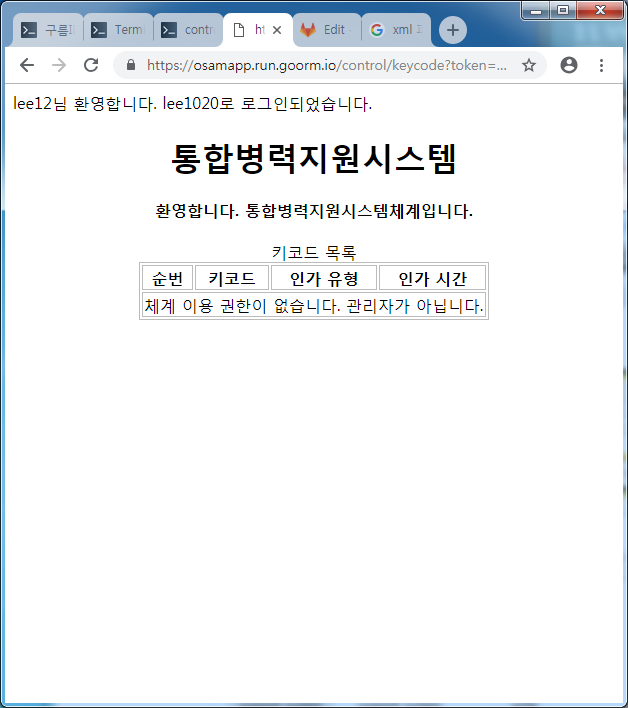
>  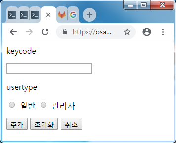

## **기능 설명**
___
> - 회원가입 인증 방식
> 회원가입시 입력하는 키코드 값은 인트라넷 상의 통합병력지원시스템에 사전 등록되어 있어야 한다.
> 통합병력지원시스템에서는 관리자만이 키코드에 접근할 수 있고 추가/제거가 가능하다. 이때 관리자는 추가하는 키코드 값이 관리자 인증용인지 일반 사용자 인증용인지 선택해야 한다. 기본값은 일반 사용자 인증이다.
> 관리자는 언제든지 키코드 값을 언제든지 삭제할 수 있다. 키코드 값이 삭제되어도 해당 키코드 값으로 가입한 사용자는 여전히 시스템을 이용가능 하며 관리자는 해당 부대의 인원이 모두 가입완료된 경우 해당 키코드 값을 제거하여 만료시키는 효과를 줄 수 있다.
> 향후 키코드 값 만료시간 지정/연장 특정 키코드 값으로 가입한 사용자 모두 만료등의 기능 구현을 생각하고 있다. 각 기수별로 키코드 값을 다르게 하여 가입토록 하면 이후 전역시 해당 사용자들을 한꺼번에 삭제하는 등 관리에 도움이 될 것으로 판단된다.
> 비밀번호는 모두 암호화되어 저장된다. 관리자조차 해당 사용자의 실제 비밀번호를 알 수 없다.
> 현재는 아이디를 원하는 값으로 지정할 수 있게 해두었지만 관리 편의 및 사용자 확인을 위해 군번으로 강제하는 방안도 생각중에 있다.
> - 로그인 인증 방식
> 회원가입시 사용된 아이디는 암호화되어 토큰으로 사용된다. 토큰은 로그인 성공시에 발급되며 다른 모든 페이지 정보 접근시 사용된다. 토큰이 일치하지 않을 경우 정보에 접근할 수 없다.
> - 사용자 정보 변경 방식
> 사용자는 자신이 변경을 원하는 정보만 입력해도 변경가능하도록 되어있다. 바꾸지 않을 정보는 공란으로 두면 서버에서 알아서 처리한다.
> - 커뮤니티 이용 방식
> 커뮤니티는 게시판으로 구성되며 사용자는 게시판을 선택하여 글을 남길 수 있다.
> 이후 업데이트시 게시판 별로 글 작성 구성을 달리하여 매치 게시판(스포츠, 보드게임, 컴퓨터 게임등에 활용), 공유교통 게시판(기지내 자전거, 출타시 택시 합승), 개인 일정 관리 기능 추가를 염두에 두고 있다.

## **참고**
---
> 프로젝트 설계서 : https://ovenapp.io/view/fz9uEK7gv7BcfeFZeKtk12zfgcliNrmQ/
> 프로젝트 파일 : https://goor.me/Y7tr
